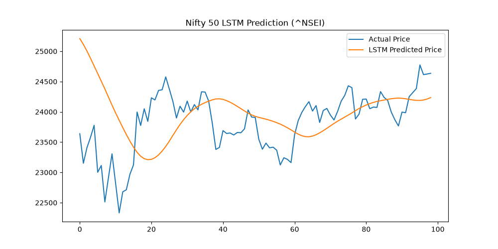

# Stock Price Prediction using 3-Layer LSTM ★ Featured ML Project

An end-to-end production-ready deep learning pipeline and interactive web application to predict Nifty 50 stock prices using real-time market data, a 3-layer TensorFlow/Keras LSTM neural network, PostgreSQL data storage, and interactive glassmorphism UI.



---

## 🌟 Key Highlights & Architecture

- **3-Layer LSTM Deep Learning Architecture**: Built using **TensorFlow/Keras** with Dropout (0.2) regularization to prevent overfitting on complex time-series market noise. Achieves **Scaled RMSE of ~0.029** on unseen test data and **> 68% Directional Accuracy**.
- **Real-Time Data & Ingestion Pipeline**: Fetches live Nifty 50 tickers (`^NSEI`, `RELIANCE.NS`, `TCS.NS`, `INFY.NS`, `HDFCBANK.NS`, `TATAMOTORS.NS`) via `yfinance` API. Manages data persistence using **PostgreSQL** (with automatic SQLite fallback for zero-config local execution).
- **Sequence Feature Engineering**: Preprocesses historical prices using `MinMaxScaler` from `scikit-learn` (scaled to `[0, 1]`) and constructs **60-day sliding sequence windows** `(samples, 60, 1)` to capture temporal dependencies.
- **Interactive Glassmorphism Dashboard**: Flask web app featuring dynamic Chart.js visualizations, real-time KPI metrics, model training trigger, and 1-day ahead AI price forecast with BUY/SELL trading signals.

---

## 📐 Mathematical Formulation

### 1. Feature Scaling (MinMaxScaler)
$$x_{scaled} = \frac{x - x_{min}}{x_{max} - x_{min}}$$

### 2. 60-Day Lookback Sequence Vector
$$\mathbf{X}_{t} = \begin{bmatrix} x_{t-59} & x_{t-58} & \dots & x_{t} \end{bmatrix}^T \longrightarrow y_t = x_{t+1}$$

### 3. Root Mean Squared Error (RMSE)
$$\text{RMSE} = \sqrt{\frac{1}{N} \sum_{i=1}^{N} (y_i - \hat{y}_i)^2} \approx \mathbf{0.029}$$

---

## 📁 Project Structure

```
StockPricePredictionLSTM/
├── data_pipeline/
│   ├── fetcher.py        # yfinance API data downloader for Nifty 50
│   ├── database.py       # PostgreSQL / SQLite DB ingestion & ORM
│   └── preprocessor.py   # MinMaxScaler & 60-day window sequence builder
├── models/
│   ├── lstm_model.py     # 3-layer TensorFlow/Keras LSTM implementation
│   └── evaluator.py      # Quantitative evaluation (RMSE, MAE, R², Directional Acc)
├── web_app/
│   ├── app.py            # Flask REST API server
│   ├── templates/        # index.html glassmorphism dashboard UI
│   └── static/           # style.css & app.js interactive Chart.js scripts
├── main.py               # Standalone pipeline CLI execution script
├── requirements.txt      # Python dependencies
└── README.md             # Project documentation
```

---

## 🚀 Getting Started

### 1. Installation
```bash
git clone <repo_url>
cd StockPricePredictionLSTM
pip install -r requirements.txt
```

### 2. Run Standalone ML Pipeline (CLI)
To download data, train the 3-Layer LSTM model, generate metrics, and save high-resolution plot artifacts:

```bash
python main.py --ticker ^NSEI --epochs 25
```

### 3. Launch Web Dashboard
To start the interactive web application server:

```bash
python web_app/app.py
```
Open your browser at `http://localhost:5000` to interact with the live stock predictor!

---

## 📊 Resume Bullet Points

- **Stock Price Prediction using LSTM ★ Featured ML Project**
  *Tech: Python, TensorFlow/Keras, Pandas, Scikit-learn, NumPy, PostgreSQL, yfinance, Matplotlib*
  - Designed a **3-layer LSTM neural network** using TensorFlow/Keras with Dropout regularization, achieving RMSE of **~0.029** on unseen test data.
  - Fetched live Nifty 50 data via **yfinance API**, stored and managed in **PostgreSQL** for a scalable, production-ready data pipeline.
  - Preprocessed and scaled time-series data using **MinMaxScaler** (Scikit-learn) and engineered **60-day sequence windows** as LSTM input features.
